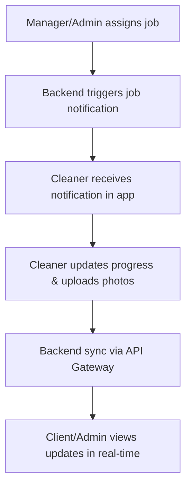

# Employee Frontend (Cleaner Mobile App)

This repository contains the **Employee Frontend** for the Handworks Cleaning Services platform.  
It is an **Android mobile application** built with **Java** and the **Android SDK**, designed specifically for company cleaners and field staff.  

Unlike the customer web portal or the admin desktop app, this frontend is **proprietary software distributed internally** and will not be released on the Google Play Store.

---

## Overview

The employee app enables cleaners to manage and complete their daily work tasks in real time.  
It is directly connected to the backend microservices through a secured API gateway.  

### Key Features
- **Job Notifications** – Receive real-time booking assignments.  
- **Task Dashboard** – View assigned cleaning sessions with details.  
- **Progress Updates** – Mark jobs as *in-progress* or *completed*.  
- **Photo Documentation** – Upload before-and-after images.  
- **Synchronization** – All updates are synced with the central backend.  

---

## Tech Stack

- **Language:** Java  
- **UI Layouts:** XML  
- **Framework/SDK:** Android SDK (API 24+ Nougat recommended)  
- **Build Tool:** Gradle (Kotlin DSL configuration)  
- **Backend Communication:**  
  - REST API Gateway (Gin, Go)  
- **Media Handling:** Cloudinary (before/after photos)  
- **Authentication:** Clerk (OAuth 2.0 + JWT)  

---

## Getting Started

### Prerequisites
- Android Studio (latest version)  
- Minimum SDK: **API 24 (Nougat, Android 7.0)**  
- Java 8+  

### Setup Instructions
```bash
# Clone the repository
git clone https://github.com/CallenCaracy/HandWorks_Mobile.git

# Open in Android Studio
# Sync Gradle dependencies
# Update API base URL in config
# Run on emulator or device
```

---

## Authentication

- Login restricted to **employee accounts only**.  
- Authentication handled via Clerk (OAuth 2.0 + JWT).  
- Employees must log in to receive job assignments.  

---

## Image Uploads

- Cleaners upload **before-and-after cleaning photos**.  
- Images stored securely with **Cloudinary**.  
- Uploads synced instantly with backend for manager review.  

---

## Data Flow



---

## Outer Repository Structure

```
employee-frontend/
 ├── app/                       # Main Android app code
 │   ├── java/                   # Java source files
 │   ├── res/                    # Layouts (XML), Drawables, Strings
 │   └── manifest/               # AndroidManifest.xml
 ├── gradle/                    # Build scripts
 ├── build.gradle.kts           # Gradle config (Kotlin DSL)
 └── README.md                  # This file
```

## Inner Repository Structure

```
app/
 ├───data                   # Handles all data sources and business models
 │   ├───dto                 # Data Transfer Objects (used for API requests/responses)
 │   ├───models              # Core app models representing entities
 │   │   └───employee         # Employee-related models
 │   ├───remote              # API service interfaces and network layer
 │   └───repository          # Repository classes that mediate between data sources & ViewModels
 ├───di                     # Dependency Injection & Retrofit setup
 ├───ui                     # All UI-related code
 │   ├───adapters            # RecyclerView adapters and other UI adapters
 │   ├───fragments           # Reusable fragments for different parts of the UI
 │   ├───pages               # Full-screen pages / activities or composable screens
 │   │   ├───auth             # Login, registration, password reset screens
 │   │   ├───chat             # Chat or messaging screens
 │   │   ├───index            # Main landing/home screens after login
 │   │   ├───settings         # App settings screens
 │   │   └───user             # User profile and account management screens
 │   └───viewmodel           # ViewModel classes managing UI logic and state
 └───utils                  # Helper classes and utility functions
     └───uistate             # UI state interfaces used for implementation of LiveData or StateFlow

```

---

## Development Notes

- App is **not public-facing** (internal distribution only).  
- Focused on **performance and reliability** in field conditions.  
- Recommended structure: Activities/Fragments with **MVVM architecture** for scalability.  

---

## License

This project is proprietary software of **Handworks Cleaning Services**.  
Unauthorized distribution is prohibited. 
